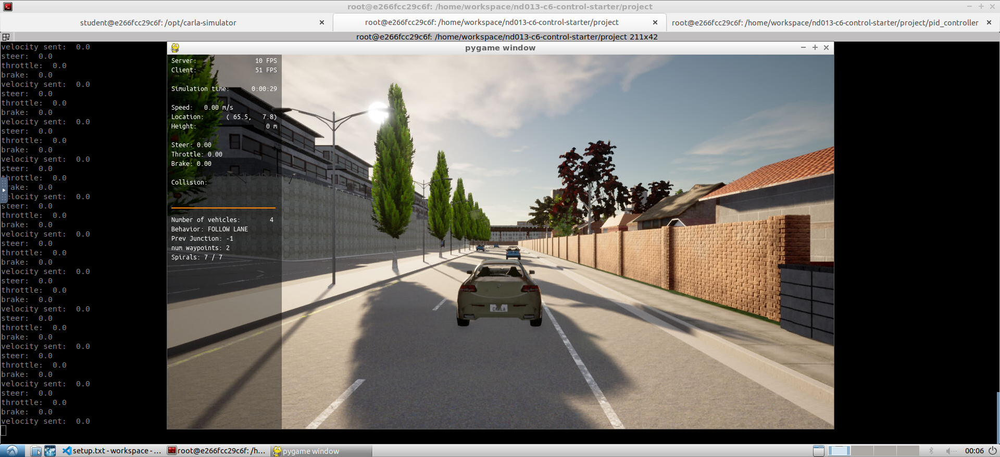
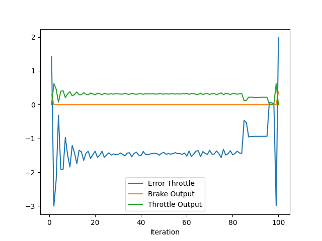
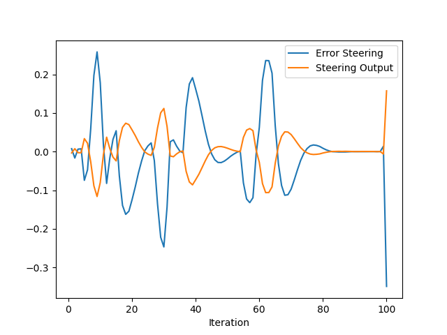

# Control and Trajectory Tracking for Autonomous Vehicles

## Results

Above is a plot of the throttle/brake outputs and the throttle error, which I defined as the difference between the current velocity and the last velocity provided by the path planner. I did not use a large derivative term, but excessive oscillation (which would be countered by a derivative term) did not seem to be a problem. There is a persistent error, seemingly constant error. An integral term would be expected to fix this but the larger integral parameters I tried did not lead to better overall performance. The quick change in desired speed as it was starting again after stopping at the end of the road lead to rapid acceleration which sometimes lead to it missing the turn. 

Above is a plot of the steering error and output. Similar to the throttle, I did not see better performance when using large derivative and integral terms, so ended up with low values for both. The plot does show some oscillation, but it did not look like much of a problem in actually navigating the street. There doesn't seem to be any persistent bias, so no need for an integral term. 
I computed the error by finding the angle between the nearest point given by the path planner and the following one, and setting the error to the difference between that angle and the actual yaw. 

## How would you design a way to automatically tune the PID parameters?

I could use the twiddle algorithm to automatically tune the parameters. I did not attempt this because of the difficulty of automatically running in the simulator multiple times and the amount of time that would take. 

## PID controller is a model free controller, i.e. it does not use a model of the car. Could you explain the pros and cons of this type of controller?

### Pros:

1) No need to create a model of the system being controlled 
2) Simple to program the controller
3) Can be tuned by trial and error
4) Computationally efficient

### Cons

1) Tuning parameters is time consuming
2) Less optimal performance
3) Can perform badly if parameters were not tuned for the same situation it faces or when there are nonlinearities 
